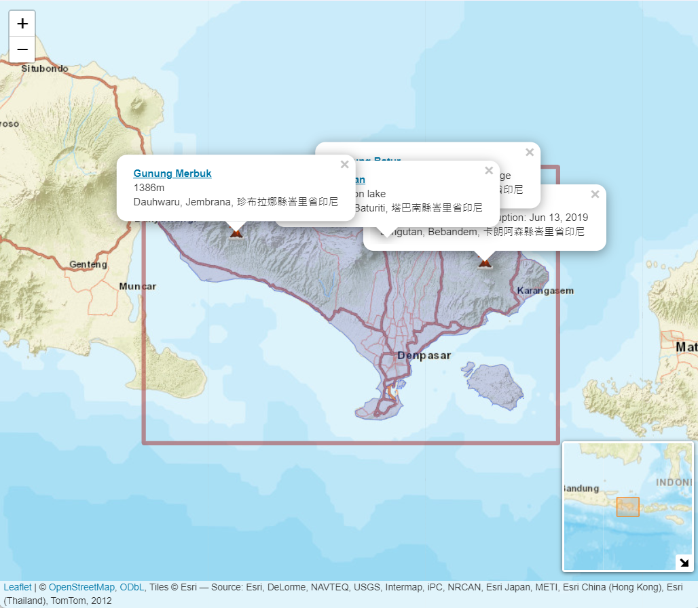

Bali, the picturesque Indonesian island known for its stunning beaches and vibrant culture, is also home to several volcanoes, making it a geologically intriguing destination. One of the most notable volcanoes on the island is Mount Agung, an active stratovolcano and the highest peak in Bali. With its last major eruption occurring in 1963, Mount Agung continues to be closely monitored due to its potential for volcanic activity.

Bali's volcanic landscapes are not just about Mount Agung; the island boasts other volcanoes such as Mount Batur, an active volcano popular for its trekking trails and the mesmerizing sunrise views from its summit. These volcanoes not only contribute to Bali's unique topography but also play a significant role in the island's cultural and spiritual heritage, with many temples and traditions associated with these majestic natural wonders. Visitors to Bali have the opportunity to explore these volcanoes, learn about their geological significance, and appreciate the deep connection between the Balinese people and their volcanic surroundings.

```{r,  eval=FALSE}
library(leaflet)
library(raster)
IDN = getData('GADM', country="IDN", level=1) # data Indoesia
Bali = IDN[IDN$NAME_1=="Bali" ,]
plot(IDN, axes=T, bg=colors()[431],col='grey')
plot(IDN, axes=T, xlim=c(114.3,115.8), ylim=c(-8.94,-7.98), bg=colors()[431],col='grey') 
# These two lines are just a check for the map

AGN = paste(sep = "<br/>",
             "<b><a href='https://id.wikipedia.org/wiki/Gunung_Agung'>Gunung Agung</a></b>",
             "Highest mt. in Bali, last eruption: Jun 13, 2019",
             "Jungutan, Bebandem, 卡朗阿森縣峇里省印尼")

Btr = paste(sep = "<br/>",
            "<b><a href='https://id.wikipedia.org/wiki/Gunung_Batur'>Gunung Batur</a></b>",
            "A valcano with fantastic lake and village",
            "South Batur, Kintamani, 邦利縣峇里省印尼")

Bra = paste(sep = "<br/>",
            "<b><a href='https://en.wikipedia.org/wiki/Bratan_(volcano)'>Gunung Bratan</a></b>",
            "With temples on lake",
            "Candikuning, Baturiti, 塔巴南縣峇里省印尼")

Mbk = paste(sep = "<br/>",
            "<b><a href='https://en.wikipedia.org/wiki/Mount_Merbuk'>Gunung Merbuk</a></b>",
            "1386m",
            "Dauhwaru, Jembrana, 珍布拉娜縣峇里省印尼")

VolcanoIcon <- makeIcon(
  iconUrl = "https://upload.wikimedia.org/wikipedia/commons/b/b0/Volcano_Emoji.png",
  iconWidth = 20, iconHeight = 20,
)

leaflet(Bali) %>%
  addPolygons(weight=0.5) %>%
  addTiles(group="Kort") %>%
  addPopups(115.50382435305141, -8.342124138574063, AGN, options = popupOptions(closeButton = TRUE)) %>%
  addPopups(115.31963066252398, -8.206619541885592, Btr, options = popupOptions(closeButton = TRUE)) %>%
  addPopups(115.18872102890141, -8.267212388340345, Bra, options = popupOptions(closeButton = TRUE)) %>%
  addPopups(114.69982945158964, -8.246826560760608, Mbk, options = popupOptions(closeButton = TRUE)) %>%
  addRectangles(lng1 = 114.40, lat1 = -8.038586475557645,
                lng2 =115.74, lat2 =  -8.92261593986891, color= 'brown', fillColor = 'transparent')%>%
  addMarkers(115.50382435305141, -8.342124138574063, icon=VolcanoIcon)%>%
  addMarkers(115.31963066252398, -8.206619541885592, icon=VolcanoIcon)%>%
  addMarkers(115.18872102890141, -8.267212388340345, icon=VolcanoIcon)%>%
  addMarkers(114.69982945158964, -8.246826560760608, icon=VolcanoIcon)%>%
  addProviderTiles(providers$Esri.WorldStreetMap) %>%
  addMiniMap(
    tiles = providers$Esri.WorldStreetMap,
    toggleDisplay = TRUE)



```

## R Markdown
